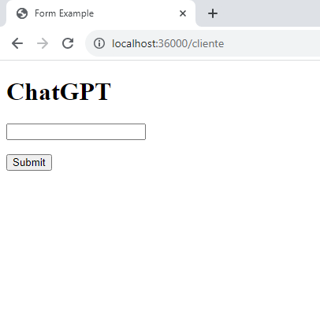
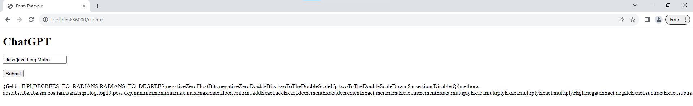
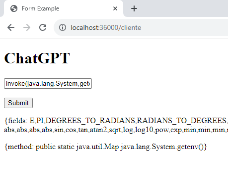
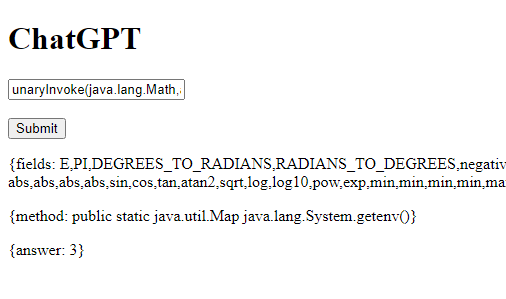
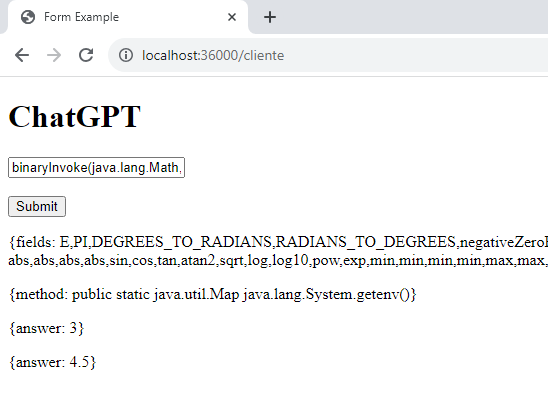

# Parcial 1 - AREP (ARQUITECTURA EMPRESARIAL)

## Instalación y Ejecución
1. Descargue este repositorio mediante el siguiente comando.
```
$ git clone https://github.com/NickArB/PARCIAL-AREP.git
```
2. Compile el proyecto haciendo uso de Maven
```
$ mvn clean compile
```
3. Ejecute las clases `Chat.java` y `Facade.java` mediante la siguiente instrucción.
```
$ java -cp target/classes com.arep.app.Facade
```
```
$ java -cp target/classes com.arep.app.Chat
```
4. Ingrese la siguiente URL en su navegador
```
http://localhost:36000/cliente
```
5. Debería aparecer una interfaz de usuario desde la que debe ingresar las instrucciones deseadas *SIN ESPACIOS*

* NOTA: Las consultas con tipos String no funcionan, ejemplo: unaryInvoke(java.lang.Integer, valueOf, String, "3") <-- Esto va a fallar ya que no se extrae el contenido de lo que esta entre comillas. Si se manda sin comillas si que funcionara, ejemplo: unaryInvoke(java.lang.Integer,valueOf,String,3)

- Interfaz de cliente



- class(java.lang.Math)



- invoke(java.lang.System,getenv)



- unaryInvoke(java.lang.Math,abs,int,3)



- binaryInvoke(java.lang.Math,max,double,4.5,double,-3.7)

